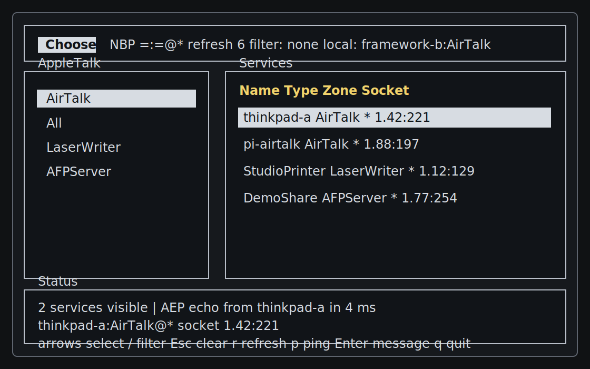

# chooser

`chooser` is the AirTalk AppleTalk service browser for LINUX Unplugged. It uses
TailTalk's userspace AppleTalk stack to run NBP lookups and displays discovered
services in a terminal UI inspired by the classic Mac OS Chooser.

It is intentionally a wrapper around TailTalk. It does not implement AppleTalk
protocols or packet parsing itself.



## Demo Day Quick Start on NixOS

Use this path when two NixOS laptops are connected to the same isolated Ethernet
switch and there is no legacy Mac on the LAN.

On both boxes, build the local release binary and grant it raw socket access:

```sh
cd /home/chrisf/build/chooser
nix develop
cargo build --release
sudo setcap cap_net_raw+eip target/release/chooser
```

Run one named Chooser instance per box:

```sh
# box A
./target/release/chooser --interface eth0 --name thinkpad-a

# box B
./target/release/chooser --interface eth0 --name framework-b
```

Replace `eth0` with the wired interface for the demo switch. Each app advertises
itself as `NAME:AirTalk@*`, discovers the other machine through AppleTalk NBP,
and accepts short ADSP messages from the other Chooser instance.

Fast checks during the live demo:

- Both machines should show an `AirTalk` service for the other host after one or
  two refreshes.
- Select the other host and press `p` to send an AppleTalk Echo Protocol ping.
- Select the other host and press Enter to send the configured ADSP message.
- If discovery is empty, re-run `setcap` after rebuilding and verify both boxes
  are on the same physical switch/interface.
- Use `--no-advertise` only for passive browsing; otherwise leave advertising on
  for the two-Linux-box demo.

## Build on NixOS

```sh
nix develop
cargo build --release
```

The flake also exposes a package and app:

```sh
nix build
nix run . -- --help
```

For EtherTalk demo runs, prefer the local Cargo-built binary so you can grant
raw socket capability to that file.

## EtherTalk Permissions

EtherTalk uses a raw socket. Run as root, or grant the release binary raw socket
capability after building:

```sh
sudo setcap cap_net_raw+eip target/release/chooser
```

If you rebuild the binary, run `setcap` again.

TashTalk-only use through a serial device does not need raw socket capability,
but your user still needs permission to access the serial device.

## Run

Browse all visible AppleTalk services on an Ethernet interface:

```sh
./target/release/chooser --interface eth0
```

By default, the TUI also advertises this Linux box as an AirTalk peer over NBP
and listens for ADSP messages. Run it on two Linux hosts on the same isolated
EtherTalk LAN and each should discover the other:

```sh
# box A
./target/release/chooser --interface eth0 --name thinkpad-a

# box B
./target/release/chooser --interface eth0 --name framework-b
```

The advertised service is `NAME:AirTalk@*`. Use `--no-advertise` for passive
browsing only, `--peer-type` to change the service type, and `--message` to set
the text sent to another AirTalk peer.

Use a TashTalk USB serial adapter:

```sh
./target/release/chooser --tashtalk /dev/ttyUSB0
```

Use a different refresh interval:

```sh
./target/release/chooser --interface eth0 --refresh 5
```

Query a specific NBP entity instead of the default wildcard `=:=@*`:

```sh
./target/release/chooser --interface eth0 --entity '=:LaserWriter@*'
```

Use the plain table fallback:

```sh
./target/release/chooser --plain --interface eth0
```

## TUI Controls

- `q` or Ctrl-C: quit
- `r`: refresh immediately
- `p`: send an AppleTalk Echo Protocol ping to the selected service
- Enter: send an ADSP message to the selected AirTalk peer
- Arrow keys: move selection
- `/`: edit filter
- Enter or Esc: finish editing filter
- Esc outside filter mode: clear filter

## TailTalk Dependency

`chooser` depends on TailTalk and `tailtalk-packets` from
`https://github.com/FeralFirmware/TailTalk.git`, pinned in `Cargo.toml`. This
keeps the public repo buildable without requiring a sibling TailTalk checkout.

## License

GPL-3.0-only. TailTalk is GPLv3, so `chooser` is GPLv3 as well.
